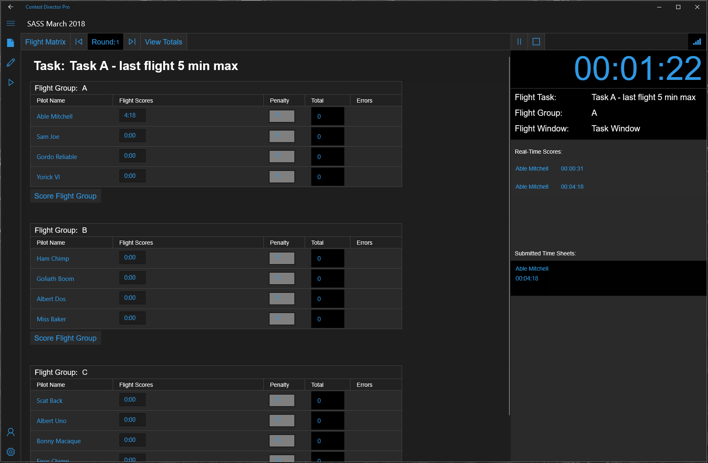
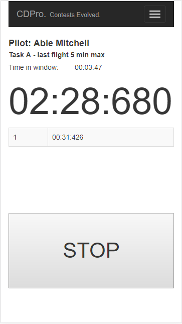

# Contest Director Pro


[Requirements](/Documentation/requirements.md)

CDPro is a set of software components that enhance the contest management task for R/C glider competitions.  Currently, the software suite contains a UWP application to run the contest and an ASP.NET Core site to 'host' the contests.



Example contest running in the UWP applicaton.  Notice the real-time scores from the timer, a submitted timesheet for the pilot and the updated flight group entry for the pilot.



Example of the timer running.  Notice the pilot name, task name, time remaining in the flight window and previously recorded flight times 

## Quick Non-Technical overview

### The UWP application

The universal Windows application is the core.  Contests are created by adding pilots, rounds and tasks and defining the makeup of the competition to be hosted.  After a contest is created, the user can choose to 'Run' the contest.  This will start the run contest workflow that will walk the user through pilot registration and running the contest rounds.  The contest clock and round / flight group sequencing is handled by this application.  Announcements are also handled by this application.  If you hook the app up to a set of external speakers, pilot names, tasks and countdowns will be cast to the external speakers.

### The Contest 'Host' website

The web site can be hosted currently on a local network (just hook up a wifi router for instance) and enhances the contest experience.  The website has a set of pages that allows clients (web browsers) that connect the ability to view the contest details (Current round, flight group etc...), flight matrix, scoreboard (TBD) and a specialized page that will allow timers to time contest rounds for pilots.

To perform the above tasks, you will connect to the site from the UWP application and cast 'events' to clients that also connect to the website.  When a new flight group is set to fly, the details will be cast to the connected timers.  A timer can then select the pilot they are timing for and when the timer is started or stopped, data will be sent to the UWP application.  When the round is over, the person using the timer can select the timed flight segments that they would like to 'score' and submit them.  This data will be sent to the UWP application and automatically update the score.    

## Intention for writing and sharing this code

### Why did I write this?
There are a couple applications currently that help run F3K competitions.  They work pretty well and the developers that have built them deserve a lot of credit for all of the hard work they have put in (thank you).  However, there a couple places that I have felt they fall short and this is why I have spent a good amount of time creating this solution.  Current solutions still require a lot of manual entry, use disconnected timers and none in my opinion provide the entire solution in one package.  At our local contests we end up using a little of this and a little of that to get the job done.  That has been one of the primary drivers for creating this software.

### Why am I sharing it?
I am sharing this code in part because the current software solutions are either partially or completely closed solutions.  I understand why they are, and do not disagree with the decisions the developers made.  I applaud them for the great work they have done, in fact.  However, I feel there is an opporitunity to create a platform that others can build off of and if the stars align, move the state of the art faster as a community effort.  It will also provide transparency into the scoring and timing for larger competitions.

## Core technologies used

 ### .NET Standard 2.0

I believe Microsoft has taken a long needed step in the right direction to create a .net assembly that can be run cross platform.  While it is still early, I feel like this has the potential to be incredibly flexibile when moving the code forward to a place where it can truely run on any device.  All non-presentation layer code is written in .NET Standard assemblies.

### UWP

This was a decision I made about 4 years ago when I started this project (yeah, it took me a while.  Life happens).  I wanted to learn more about creating these applications.  Looking back I wish I would have changed to Xamerin when they were aquired, but the good news is that this can still be done.  The presentation layer is abstracted from the core of the application, so with a little bit of effort, this could truely run on any platform.

### Template 10

Creating a UWP application from the ground up requires a bit of boiler plate code to get things up and running.  The Microsoft evangelists took it upon themselves to short cuircut app development by creating a framework of sorts for building UWP applications.  Lots of the boiler plate code is covered by Template 10, so it was an easy choice to use this as a starting point.  However, in the past couple of weeks, they have announced that the future of Template 10 will be integrated into a more formal project (Prism).  This does not pose any problems for what is in this project currently.  However, to be truely crossplatform, the presentation layer will need to be converted to Prism (UWP Project).

### ASP.NET Core

Simple choice here.  ASP.NET Core is a slimmed down version of the traditional ASP.NET, built on .NET Standard.  Want to host the site on a linux box? Cool. Console App? Awesome. Windows box? No problem.  Performance is far better than traditional ASP.NET and it has a middleware workflow that allows a lot of flexibility.

### Aurelia with Bootstrap and Typescript

The Website is a SPA application built on Aurelia and Typescript.  I chose Aurelia because I was evaluating it for another project at work and really liked the symantic-like markup. And it just seemed to get out of your way when coding.  It's also very typescript friendly.  

I chose Typescript because I'm not a javascript guru and am used to object oriented programming.  I like the design time error checking (in supported IDE's) as well.  Using it in the distant past when it was first released saved code bases I was working on at the time from a lot of bugs that would not have been caught earlier in the IDE if using plain old javascript.  I like catching bugs at design time and not in testing or worse, production environments. 

I didn't really choose Bootstrap, it was just there when I created the solution from the 'dotnet new aurelia' command ;). 

### SignalR

Core to the entire solution.  Provides push communications between components via websockets.  If you have used a chat application, chances are that you have used SignalR.  Real-time communications are enabled via this tech.  It's Low latency and allows persistant connections between clients. 

## Software Design

If you have not read any of Uncle Bob's literature, it would be good to check it out now.  The design of this app was heavily influenced by his 'Clean' software 'Architecture'.  I feel like his approach is more of an approach to software design, but that's me.  It's a good foundation so I used this project to test it out for myself and it seems to be pretty solid, no matter what you call it :).  I will say that I did not follow his patterns as religion.  It started to feel a bit to granular in some places and in order to save contributors from class creation hell, I took the liberty to do some aggregation of functionality in places. That said, there is a fair amount of separation.

Below is the project structure.  The dependency chain flows from the bottom up (skipping the 'common' projects).  Read: Last item in each list below depends on one or more of the projects / assemblies above it and so on as you go from bottom up for each solution. 

### UWP Solution

+ AppDomain project (shared) - Foundational classes, Enterprise business logic
+ CoreApp project (shared) - Core business logic
+ Interfaces project (shared) - Defines functionality and repositories.  Lightweight, want to extend the app, you don't need to inherit everything to do it.
+ Repository project(s) - Data storage
+ Algo Implementations - Scoring, flight matrix sorting, etc... 
+ UWP Application project - Presentation layer
+ Common project (shared) - Cross cutting features and classes, breaks the dependency rules.  Ex: Logging classes

### Contest Host (website) Solution

+ AppDomain project (shared) - Foundational classes, Enterprise business logic
+ CoreApp project (shared) - Core business logic
+ Interfaces project (shared) - Defines functionality and repositories.  Lightweight, want to extend the app, you don't need to inherit everything to do it.
+ Repository project - Data storage
+ Site project - Presentation layer / Website, API's, SignalR hub
+ Common project (shared) - Cross cutting features and classes, breaks the dependency rules.  Ex: Logging classes

### Final thoughts on project layouts

One other thing I took from Uncle Bob was what he calls 'Screaming Architecture' in the project structures.  Still not sure why he calls everything 'architecture'...  When you look at the projects, the folders may not look familiar if you are used to MVC (ASP.NET / Ruby) or MVVM (UWP).  There aren't any 'ViewModel' or strict 'Model' folders for instance.  All of the code is organized by the feature it supports.  

This does two core things: 1. It makes it really easy to figure out where the code is that runs a feature area of your product, and 2. It tends to separate code by features organically.  If you create a folder labeled 'Sign in', developers will probably throw any new code related to that feature in there and keep things tidy.  

Also developers like to write sharable code (good).  In some cases, it shouldn't be shared as it tightly couples features (bad).  Dropping code in a folder that doesn't match up feels weird, so in a small way it helps contributors keep code separated.  It's also easy to remove features.  For instance, in a lot of cases you can just delete the feature folder and clean up a few entry points if you want to remove a feature.

## API's

The server (Contest 'Host' website) exposes two kinds of endpoints: REST endpoints and SignalR endpoints.  Pick your poison, by the time this code reaches 1.0, my hope is that they are mirrored as much as possible.  That way the developer looking to build a phone app to use instead of the browser can choose either a push or a pull model (push would be preferred for the clients, but up to the implementor).

I'm not going to document all the API's here just yet as they are still in flux.  However, below is a list of SignalR endpoints available on the server now that are pretty well established:

```csharp
   /// <summary>
   /// Handles the FinalTimeSheetPosted event / message.
   /// </summary>
   /// <param name="args">The <see cref="FinalTimeSheetPostedEventArgs"/> instance containing the event data.</param>
   /// <returns></returns>
   public async Task FinalTimeSheetPosted(FinalTimeSheetPostedEventArgs args) ...

   /// <summary>
   /// Handles the FlightTimerStopped event / message.
   /// </summary>
   /// <param name="args">The <see cref="FlightTimerEventArgs"/> instance containing the event data.</param>
   /// <returns></returns>
   public async Task FlightTimerStopped(FlightTimerEventArgs args)...

   /// <summary>
   /// Handles the FlightTimerStarted event / message.
   /// </summary>
   /// <param name="args">The <see cref="FlightTimerEventArgs"/> instance containing the event data.</param>
   /// <returns></returns>
   public async Task FlightTimerStarted(FlightTimerEventArgs args) ...

   /// <summary>
   /// Handles the NewRoundAvailable event / message.
   /// </summary>
   /// <param name="args">The <see cref="NewRoundAvailableEventArgs"/> instance containing the event data.</param>
   /// <returns></returns>
   public async Task NewRoundAvailable(NewRoundAvailableEventArgs args) ...

   /// <summary>
   /// Handles the RoundTimerStarted event / message.
   /// </summary>
   /// <param name="args">The <see cref="RoundTimerEventArgs"/> instance containing the event data.</param>
   /// <returns></returns>
   public async Task RoundTimerStarted(RoundTimerEventArgs args) ...

   /// <summary>
   /// Handles the RoundTimerStopped event / message.
   /// </summary>
   /// <param name="args">The <see cref="RoundTimerEventArgs"/> instance containing the event data.</param>
   /// <returns></returns>
   public async Task RoundTimerStopped(RoundTimerEventArgs args) ...

   /// <summary>
   /// Handles the RoundTimerClockPing event / message.
   /// </summary>
   /// <param name="args">The <see cref="RoundTimerEventArgs"/> instance containing the event data.</param>
   /// <returns></returns>
   public async Task RoundTimerClockPing(RoundTimerEventArgs args) ...
        
```
